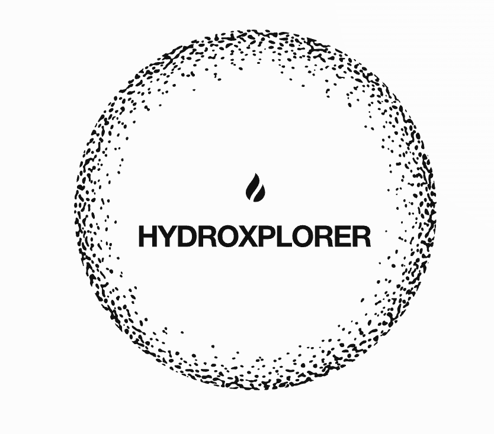
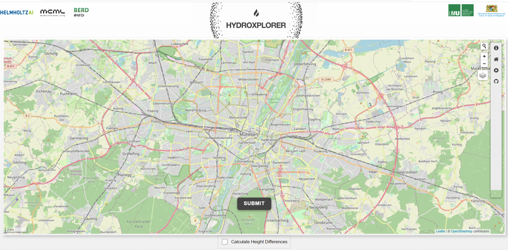
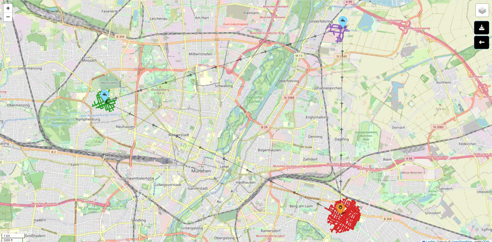

==========================
HydroXplorer Documentation
==========================

This is the documentation for `HydroXplorer: The DSSGx Fire Hydrant Range Finder application <http://hydroxplorer.dssgxmunich.org/>`_.

.. toctree::
   :maxdepth: 2
   :caption: Code

   modules
   
User Guide
==========
We have developed a web application to help firefighters determine the areas covered with existing and planned hydrants.

You can access the web application at http://hydroxplorer.dssgxmunich.org.

Below is the homepage of the web application:

| You can add a point of interest in two ways:
| *Interactively*: Double-click on the point of interest on the map.
| *Search*: Use the  search button and type the desired address.

As soon as you select a point on the map, a pop-up window will appear with the following required input:

1. **Hose Length**: Expects a numerical value.

2. **Transport Mode**:

  * *Walking*: Route optimized for walkers.

  * *Driving*: Driving directions for motor vehicles.

  * *Cycling*: Fits Portable Fire Pump Trolley.

  * *Service Driving*: Drivable public streets (incl. service roads).

3. **Point Type**: Select whether the point is a fire or a water source.

**Elevation**: You can tick the box titled "Calculate Height Differences"
to get the elevations for different points, and see their relative heights.

After specifying the input points, click the ``Submit`` button to get results.

Below is an example of the interactive map you get as a result:

You can change the terrain of the map using the terrain selector on the top right.

| Using the download button, you can download the map to view it locally. 
| (All the map elements still remain interactive in the locally downloaded html file.)

| Use the back button to go back to the homepage and type different inputs.

| To avoid errors, keep in mind the input values restriction, outlined below.

Input Values Restrictions:
--------------------------

* Hose length: 120 to 5000 meters.
* Max 10 points on the map.
* Point-to-point distance limit: 20,000 meters.
* For the source code of the application, refer to our `GitHub repository <https://github.com/DSSGxMunich/hydroxplorer-web-app/>`_.

Indices and Tables
==================

* :ref:`genindex`
* :ref:`modindex`
* :ref:`search`
